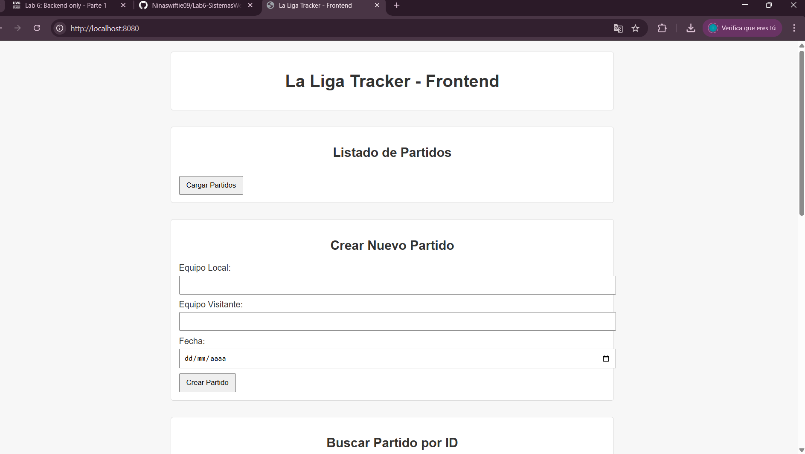

# La Liga Tracker - Backend

## Funcionalidades Implementadas

- **GET** `/api/matches` - Obtener todos los partidos.
- **GET** `/api/matches/{id}` - Obtener un partido por ID.
- **POST** `/api/matches` - Crear un nuevo partido.
- **PUT** `/api/matches/{id}` - Actualizar un partido existente.
- **DELETE** `/api/matches/{id}` - Eliminar un partido.
- (5 puntos) Por implementar un endpoint PATCH /api/matches/:id/goals - para actualizar los goles de un partido.
- (5 puntos) Por implementar un endpoint PATCH /api/matches/:id/yellowcards - para registrar una tarjeta amarilla.
- (5 puntos) Por implementar un endpoint PATCH /api/matches/:id/redcards - para registrar una tarjeta roja.
- (5 puntos) Por implementar un endpoint PATCH /api/matches/:id/extratime - para registrar el tiempo extra del partido.
- (10 puntos) Por incluir un archivo Swagger para documentar el API
- (15 puntos) [Criterio subjetivo] Calidad de la documentación del código y README
- (5 puntos) Por incluir un archivo llms.txt que explique el uso de su api
- (5 puntos) Por correctamente configurar el manejo de solicitudes CORS 

## Requisitos

- **Go 1.16 o superior**
- **PostgreSQL**
- **Docker** 
- **Postman**

 Frontend corriendo en el 8080:

